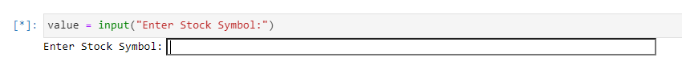
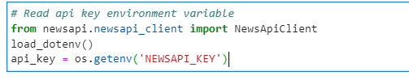
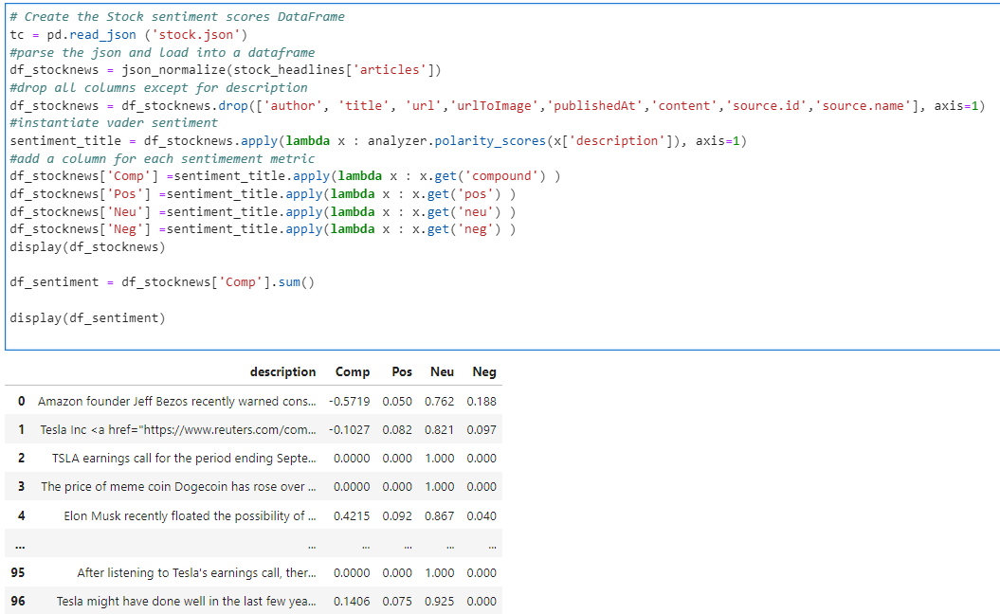
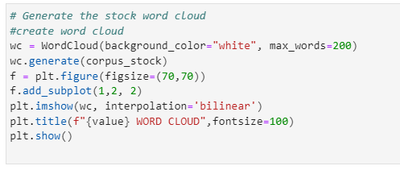

# Stock Sentiment Word Cloud

Application that allows users to input a stock ticker and generate a word cloud of the sentinments around the stock. Generates a csv file for news headlines and PNG image for word cloud. 

--- 

## Technologies

This project leverages Python 3.7 and Jupyter Lab with the following packages:

* [Pandas] (https://github.com/pandas-dev/pandas) - To create and manipulate dataframes
* [NewsAPI] (https://newsapi.org/) - To pull news data
* [NLTK] (https://github.com/nltk/nltk) - To clean and generate wordcloud from news data
* [Wordcloud] (https://github.com/amueller/word_cloud) - Used to generate final wordcloud display
* [Tradingview-TA] (https://github.com/brian-the-dev/python-tradingview-ta) - For market sentiment & recommendations from Tradingview
* [Matplotlib] (https://github.com/matplotlib/matplotlib) - Used to generate final wordcloud display

(Import code blocks included in application)

--- 

## Installation Guide

Before running the application, first install the following dependencies 

```python
  pip install pandas
  pip install tradingview_ta
  pip install --upgrade mplfinance
  pip install hvplot
```
And get API key from newsapi.org

---

## Usage

To use the Stock Sentiment application, clone the repository and run the **Stock Sentiment Analyzer.ipynb** on Jupyter Lab. 

Run the import code blocks and type in stock ticker of your choice at the prompt for analysis.

Includes Tradingview Recommendation block. Simply type in ticket you want in ' symbol="TICK" ' to get Tradingview's recommendations on the stock. 

---

## Examples

Upon running the inital code for NewsAPI, you will asked to input a stock ticker for data (ex. TSLA, GOOG, META) 


---
Get API key:


---
Sentiment Value Dataframe code:


---
After running the rest of the code including the tokenized news data you will be able to generate the Word Cloud: 




